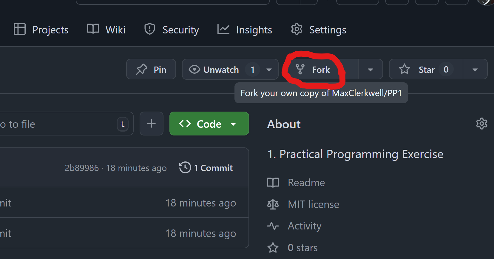
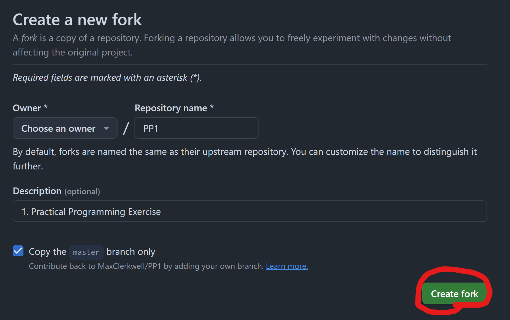
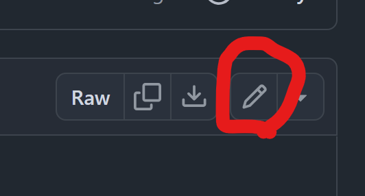
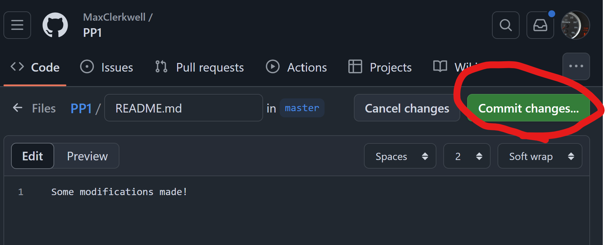

# PP1 Phil Reinartz Test

## Goal
All PPn practical exercises share a common purpose: to help you demonstrate—step by step—that you followed and understood the content presented in the weekly lectures. This ongoing feedback loop allows me, as your lecturer, to monitor your personal progress.

In this first exercise, your goal is to demonstrate an understanding of digital computation: specifically, how to map elements of an input set to an output set. We'll begin with simple mappings and gradually increase the difficulty.

**Important:** Start a stopwatch when you begin and work uninterruptedly for 90 minutes. Once time is up, stop immediately and document the point where you had to pause.

---

## Workflow
Each exercise will follow the same basic workflow:

1. **Fork** the repository
2. **Modify and Commit** your solution
3. **Submit your link for Review**

### Step 1: Fork the Repository
A fork is a personal copy of this repository under your own GitHub account. You can edit and manage it freely. Even if you make mistakes, you can always restart or revisit your progress.

To fork this repository:

1. Create a GitHub account (you may use your university email).
2. Open this project in your browser.
3. Click the `Fork` button in the top-right corner:

   

---

4. Scroll down in the dialog and click `Create fork`:

   

---

### Step 2: Modify and Commit
A **commit** is a saved snapshot of your work.

1. Navigate to the `README.md` file.
2. Click the pencil icon to edit the file:

   

---

3. Use the built-in editor to make changes.
4. Click `Commit changes` when done:

   

---

Add a meaningful comment about what you did and how long it took.

### Step 3: Submit for Review
If you get stuck, visit the discussions forum:
[https://github.com/MaxClerkwell/PP1/discussions](https://github.com/MaxClerkwell/PP1/discussions)

When you have finished working, in Moodle, click "Add solution" and submit the link to your repository.

---

## Tasks

### Task 1: Mapping Symbols to Binary
Fill out the following table, mapping decimal numbers `0` through `15` to their binary representations:

| Decimal | Binary Representation |
|---------|------------------------|
| 0       | 0000                   |
| 1       | 0001                   |
| 2       | 0010                   |
| 3       | 0011
| 4       | 0100
| 5       | 0101
| 6       | 0110
| 7       | 0111
| 8       | 1000
| 9       | 1001
| 10      | 1010
| 11      | 1011
| 12      | 1100
| 13      | 1101
| 14      | 1110
| 15      | 1111                   |

**How many binary digits (bits) are needed?**

Explain how to calculate the number of bits required:

Your Answer

Option 1 (Calculation for number of digits and the resulting bin number) :
To calculate you have to devide your dec number through 2
for example: 
   
   23/2

 Instead of writing the (Komma Zahl) you devide by the next lower number and write rest 1.
 for example:

 23/2= 11 R1

 You do this till you get to Zero.

for example:
23/2= 11 R1

11/2=  5 R1

5/2=   2 R1

2/2=   1 R0

1/2=   0 R1

The resulting bin number is read from bottom to top. (only the number behinfd the R is used)

23 dez = 10111

Now you can easy count your digits.
Number of digits = Number of bits needed.

---

### Task 2: Mapping Binary to Binary
Digital processors implement **logical functions** using **logic gates** like NAND, AND, OR, etc.
These functions map binary input sets (voltages) to binary outputs.

Refer to the truth table of a 1-bit full adder:

| Cin | B | A | Sum (S) | Cout |
|--------------|---|---|---------|-----------------|
| 0            | 0 | 0 | 0       | 0               |
| 0            | 0 | 1 | 1       | 0               |
| 0            | 1 | 0 | 1       | 0               |
| 0            | 1 | 1 | 0       | 1               |
| 1            | 0 | 0 | 1       | 0               |
| 1            | 0 | 1 | 0       | 1               |
| 1            | 1 | 0 | 0       | 1               |
| 1            | 1 | 1 | 1       | 1               |

> Simulate this adder using NAND gates:
[Full Adder NAND CircuitVerse Project](https://circuitverse.org/users/305021/projects/full-adder-nand-990621f6-993b-4676-a1b5-2a31aae451ce)

#### Your Task
Create a truth table for a **2-bit adder** without carry-in. What are the possible inputs and outputs?

|A | B|Q  |
|--|--|---|
|00|00|000|
|00|01|001|
|00|10|010|
|00|11|011|
|01|00|001|
|01|01|010|
|01|10|011|
|01|11|100|
|10|00|010|
|10|01|011|
|10|10|100|
|10|11|101|
|11|00|011|
|11|01|100|
|11|10|101|
|11|11|110|

### Task 3: Boolean Equations via Karnaugh Maps
Use the [K-Map method](https://github.com/STEMgraph/4b957490-badf-4264-b9f2-1b5aa370f36e) to derive Boolean equations for each output bit in your 2-bit adder.

1. Fill out Karnaugh Maps

|  Q0      | A1=0 A0=0 | A1=0 A0=1 | A1=1 A0=1 | A1=1 A0=0 |
|----------|-----------|-----------|-----------|-----------|
| B1=0 B0=0|          0|        [1]|        [1]|          0|
| B1=0 B0=1|        {1}|          0|          0|        "1"|
| B1=1 B0=1|        {1}|          0|          0|        "1"|
| B1=1 B0=0|          0|        °1°|        °1°|          0|

|  Q1      | A1=0 A0=0 | A1=0 A0=1 | A1=1 A0=1 | A1=1 A0=0 |
|----------|-----------|-----------|-----------|-----------|
| B1=0 B0=0|          0|          0|        °1°|        #1#|
| B1=0 B0=1|          0|       {17}|          0|        #1#|
| B1=1 B0=1|        (1)|          0|        "1"|          0|
| B1=1 B0=0|        (1)|        [1]|          0|          0|

|  Q2      | A1=0 A0=0 | A1=0 A0=1 | A1=1 A0=1 | A1=1 A0=0 |
|----------|-----------|-----------|-----------|-----------|
| B1=0 B0=0|          0|          0|          0|          0|
| B1=0 B0=1|          0|          0|        {1}|          0|
| B1=1 B0=1|          0|        [1]|        (1)|        (1)|
| B1=1 B0=0|          0|          0|        (1)|        (1)|

2. Write down an equation for each cell marked `1`
Disclaimer:These signs (like °°,##,{},...) are only for my visual help, they have no logical sence. 

Q0= {A1'˄A0'˄B0},"A1˄A0'˄B0",[A0˄B1'˄B0'],°A0˄B1˄B0°

4. Combine them using OR gates

Q0=(A1'˄A0'˄B0)˅(A1˄A0'˄B')˅(A0˄B1'˄B0')˅(A0˄B1˄B0) test out of truth table:
test out of truth table: 
|A | B|Q  |
|--|--|---|
|00|01|001|
|00|11|011|
|00|10|010|

A1=0 ,A0=0 , B1=0 ,B0=1 ,Q0=1

Q0=(A1'˄A0'˄B0)˅(A1˄A0'˄B0)˅(A0˄B1'˄B0')˅(A0˄B1˄B0)
Q0=(0'˄0'˄1)˅(0˄0'˄1)˅(0˄0'˄1')˅(0˄0˄1)
Q0=(1)˅(0)˅(0)˅(0)=1 (Correct)

Here is the point of 92 Minutes I had much trouble with the Boolean Equations and with the github editor.

A1=0 ,A0=0 , B1=1 ,B0=1 ,Q0=1

Q0=(A1'˄A0'˄B0)˅(A1˄A0'˄B0)˅(A0˄B1'˄B0')˅(A0˄B1˄B0)
Q0=(0'˄0'˄1)˅(0˄0'˄1)˅(0˄1'˄1')˅(0˄1˄1)
Q0=(1)˅(0)˅(0)˅(0)=1 (Correct)

A1=0 ,A0=0 , B1=1 ,B0=0 ,Q0=0

Q0=(A1'˄A0'˄B0)˅(A1˄A0'˄B0)˅(A0˄B1'˄B0')˅(A0˄B1˄B0)
Q0=(0'˄0'˄0)˅(0˄0'˄0)˅(0˄1'˄0')˅(0˄1˄0)
Q0=(0)˅(0)˅(0)˅(0)=0 (Correct)
5. Minimize the equations

The final functions

Q0 = .......

Q1 = .......

Cout = .......

---

### Task 4: Circuit Implementation
Using your Boolean equations, build a logic network in [CircuitVerse](https://circuitverse.org) that implements at least one bit of the adder.

Your solution

A share link to your solution goes here: <a href=".................">Link!</a>

---

**Remember:** Stop working after 90 minutes and record where you stopped!

